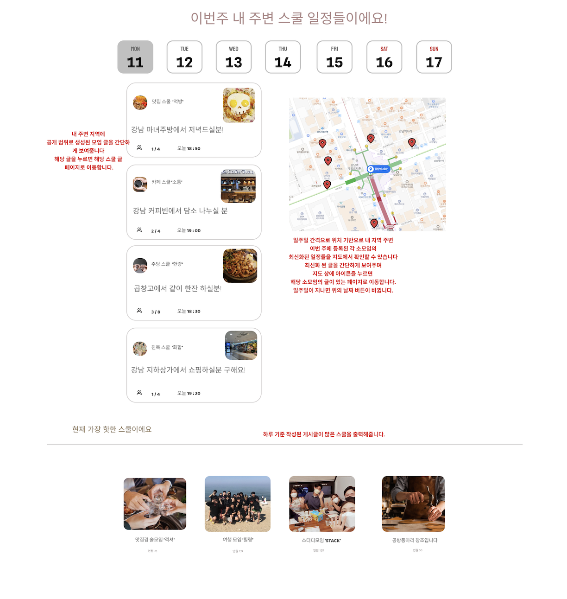
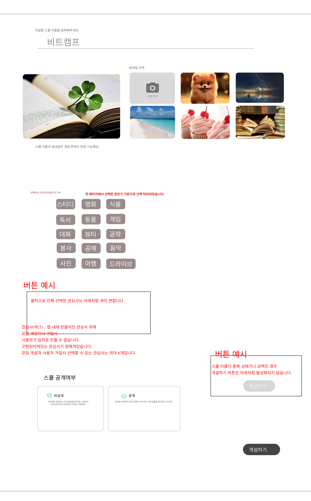
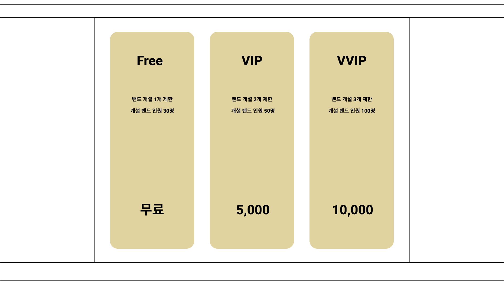
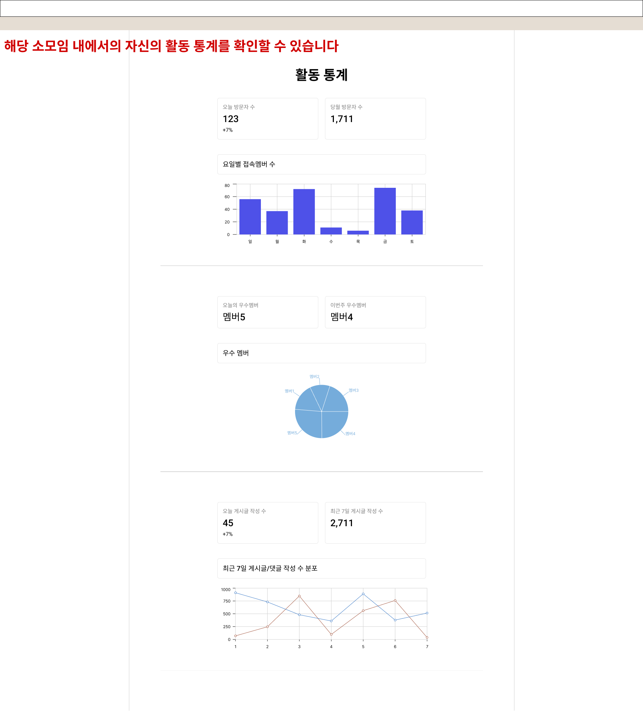
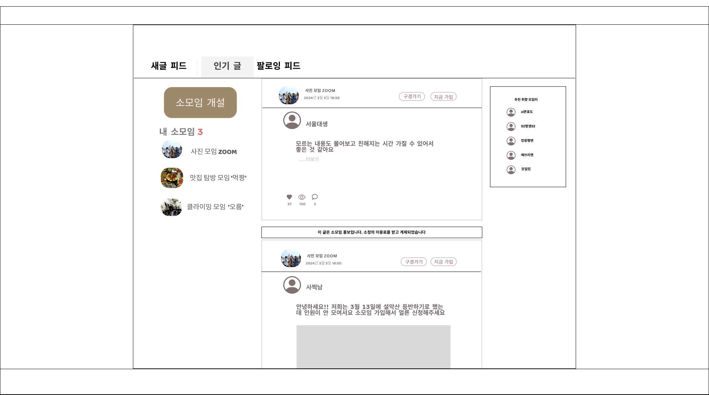
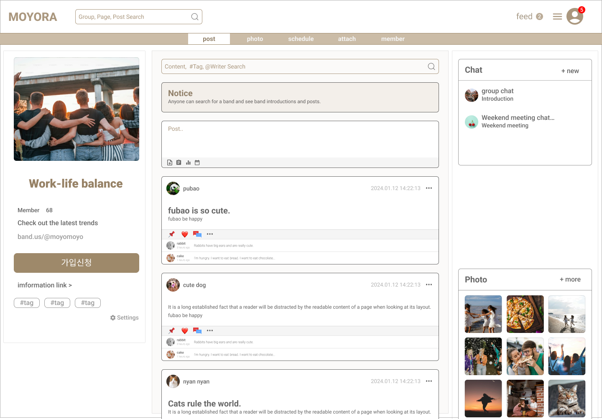

# 유스케이스

### 고유명사 정의
 
 

- `스쿨` : `모여라` 내 개설된 `모임`
- `클래스` : `스쿨` 내 등록된 특정 `모임 일정`

## 액터

 
 

- `사용자` : `로그인`을 하지않은 `사용자`

 

- `회원` : `회원가입`한 `사용자` 

 

- `스쿨 관리자` : `스쿨`을 개설한 관리 권한을 지닌 `회원`

 

- `스쿨 가입자` : `스쿨`에 가입한 `회원`

 
 

## use - case

 
 

### 사용자

  회원가입

 
 

 - `소셜 회원가입`

  
  

  공개정보조회 (스쿨,회원,게시글,클래스)

 
 

  - `통계 시스템`
 
 

### 회원
 
 

- `로그아웃`

 

- `공개정보조회` (스쿨,회원,게시글,클래스)

  
 

  - `스쿨가입`

  
 

  - `회원탈퇴`

  
 

  - `활동알림`
 
 

  - `결제내역 조회`
 
 

 
  로그인

 
 

  
  개인 프로필 설정

 
 

 

  

   
  스쿨 개설

 
 

 
 

  
 
  
 스쿨 회원 조회

 
 

 

 
  

 회원 팔로우시스템

 
 

 구독 시스템

 
 

 회원 활동통계

 
 

 스쿨추천시스템

 
 

 1:1 채팅

 
 

### 스쿨 회원

 

- `공지 게시판` (조회 가능)

 

  - `회원 신고` (스쿨 내 신고 게시판에 저장)

 

  - `스쿨 탈퇴`

 

 게시글 관리(공개 게시글 조회,개인 게시글 관리)

  
 

 클래스 개설 및 참여 (클래스 캘린더)

  
 

 클래스 개설 및 참여(클래스 등록)

 
 

 클래스 개설 및 참여(클래스 완료 및 인증)

 
  

 스쿨 채팅

 
 

### 스쿨 관리자

 

 스쿨 관리 (스쿨 공개 범위 ,가입 조건 등)

 
 

 멤버 관리 (가입 수락,블랙 리스트 ,추방,등)

 
 

  - `스쿨 전체 게시글 관리` (`작성자` 외 `삭제`,`변경` 가능)

 

  - `신고 게시판 조회` (`스쿨` `회원` 신고내역 확인 가능)

 

- `공지 게시판` (`등록`,`삭제`,`변경` 가능)

 

- `클래스 관리` 

 

- `저장소 관리` (ex : `구독` 만기후 삭제 대기전 임시 보류중인 `구독` 기능을 통해 `개설`한 `스쿨` 관리) 

 

- `스쿨 삭제` 

 

### 타이머

- `구독 해지` 

 
 
 
  

